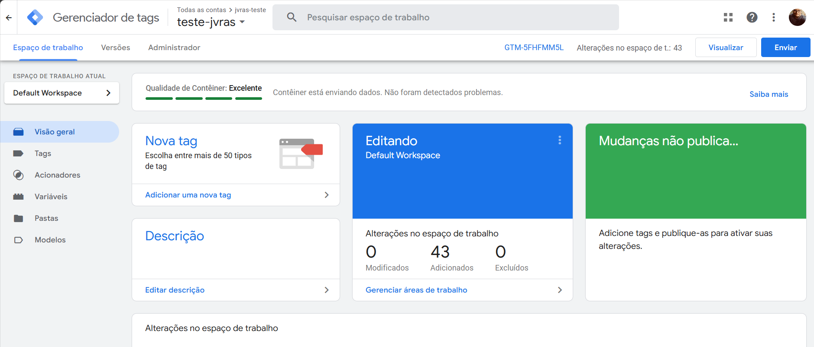
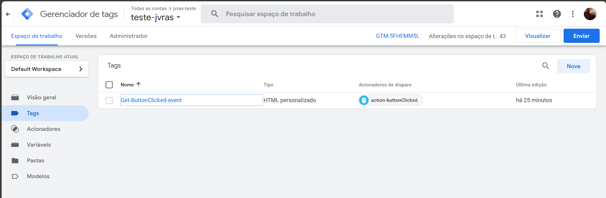
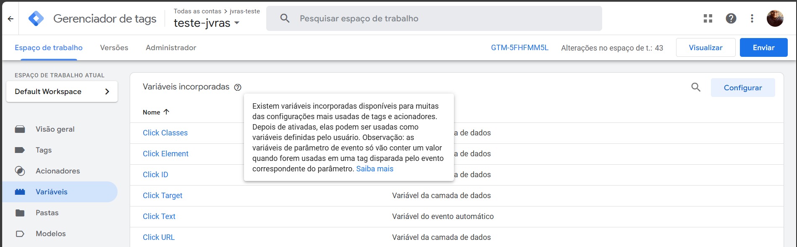
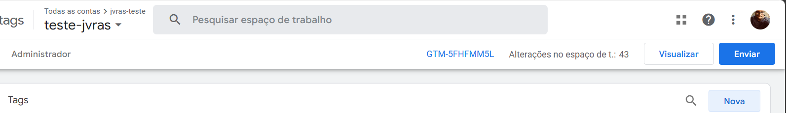

### Projeto de Telemetria e Usabilidade com Google Tag Manager (GTM)

Este projeto visa estudar a implementação de uma telemetria utilizando o Google Tag Manager (GTM) em um projeto real.

#### Configuração Inicial

1. **Documentação do Next.js**:
   - O Next.js facilita a integração com bibliotecas do GOOGLE GTM. Consulte a documentação oficial: [Next.js - Third Party Libraries](https://nextjs.org/docs/app/building-your-application/optimizing/third-party-libraries).

2. **Configuração do GTM**:
   - Para configurar o GTM no projeto, siga este tutorial em vídeo: [Configuração do GTM](https://www.youtube.com/watch?v=R5P0hWixp-8).
   - Alternativamente, consulte a documentação oficial: [Documentação GTM](https://developers.google.com/tag-platform/gtagjs?hl=pt-br).

#### Implementação

O projeto utiliza o Next.js API Routes para simular uma API dentro do próprio Next.js, facilitando o estudo de casos. Configuramos uma tag específica para capturar eventos de clique.

#### Tela Inicial do Google Tag Manager



### Configuração de Eventos

Podemos configurar diversos eventos e checagens para buscar e capturar dados, injetando scripts nas tags.

Essas checagens podem ser realizadas em páginas, formulários, elementos, entre outros. Elas vão além de cliques ou textos inseridos.

**Atenção: o GTM possui limitações quanto ao JavaScript que consegue interpretar. Considere que ele só executa JavaScript mais antigo, sem muitas funcionalidades modernas como funções de array e outras inovações.**



Se alguns tipos de eventos nos acionadores das tags não aparecerem, é necessário ir em variáveis para configurar. Por padrão, ele não habilita novos tipos de tag, e a recomendação é ativar todas.




## *Configuração de algumas TAGs feitas para teste**

### **Parte 1: Configuração do Envio de Eventos de Clique para API**

#### **1.1. Criação de Variáveis Padrão de Clique no GTM**

No GTM, para capturar informações sobre o clique (elemento clicado, URL, etc.), devemos habilitar as **variáveis automáticas** de clique.

1. Acesse o **Google Tag Manager**.
2. Vá até o menu lateral e clique em **Variáveis**.
3. Na seção de **Variáveis Incorporadas**, clique em **Configurar**.
4. Habilite as seguintes variáveis de clique:
   - **Click Element** (Elemento clicado)
   - **Click ID** (ID do elemento clicado)
   - **Click Classes** (Classes do elemento clicado)
   - **Click Text** (Texto do botão ou elemento clicado)
   - **Page URL** (URL da página onde o clique ocorreu)

Essas variáveis serão utilizadas para capturar detalhes do clique.

#### **1.2. Criação do Acionador de Clique no Botão**

Agora, configuraremos o **acionador de clique** que será ativado quando o botão "Acessar" for clicado.

1. No menu do GTM, vá para **Acionadores**.
2. Clique em **Novo** para criar um acionador.
3. Selecione **Tipo de Acionador: Clique - Todos os Elementos**.
4. Em **Este Acionador será acionado em**, escolha **Alguns Cliques**.
5. Defina a condição para o acionamento:
   - **Click ID** igual a `Acessar-click` (esse é o ID do botão que está configurado como id do button no next.js).
6. Salve o acionador com o nome **Clique em Botão Acessar**.

#### **1.3. Criação da Tag para Enviar Dados de Clique para a API**

Agora vamos criar uma tag que vai enviar as informações do clique para a sua API.

1. Vá para **Tags** no menu do GTM.
2. Clique em **Nova** para criar uma nova tag.
3. Escolha o tipo **HTML Personalizado**.
4. No campo de código da tag, insira o seguinte código JavaScript:

```javascript
<script>
var data = {
  event: 'click',
  elementId: '{{Click ID}}',   // Usando o ID do botão
  element: '{{Click Element}}', // Elemento HTMLButtonElement
  elementText: '{{Click Text}}',  // Capturando o texto "Acessar"
  url: '{{Page URL}}',  // A URL da página onde o clique aconteceu
  timestamp: Date.now()
};

  var xhr = new XMLHttpRequest();
  xhr.open('POST', 'http://localhost:3000/api/data', true);
  xhr.setRequestHeader('Content-Type', 'application/json');
  xhr.send(JSON.stringify(data));
</script>
```

5. Adicione o **acionador** que criamos anteriormente (**Clique em Botão Acessar**).
6. Salve a tag com o nome **Tag de Envio para API - clickAcessar**.

#### **1.4. Testar a Configuração de Clique**

1. No GTM, clique em **Visualizar** para ativar o **modo de pré-visualização**.
2. Vá até a página do seu site e clique no botão "Acessar".
3. No painel de pré-visualização, verifique se o evento está sendo disparado e se as informações do clique (elemento, URL, etc.) estão sendo enviadas corretamente.

---

### **Parte 2: Capturar o Valor de um Campo `<span>` e Enviar via POST**

#### **2.1. Criação de Variável Personalizada para Capturar o Valor do span**

Vamos agora capturar o valor do campo (`<span>`) quando o botão "Acessar" for clicado. Para isso, criaremos uma **variável JavaScript personalizada** que vai acessar o valor do campo.

1. No menu do GTM, vá para **Variáveis**.
2. Clique em **Nova** para criar uma nova variável.
3. Selecione o tipo **JavaScript Personalizado**.
4. Nomeie a variável como **Valor span**.
5. No campo de código da variável, insira o seguinte JavaScript:

```javascript
function() {
  var spanElement = document.getElementsByClassName('amount'); // o span esta configurado desta maneira no BetCard e esse script ta configurado para pegar o terceiro
  console.log(spanElement)
  return spanElement ? spanElement[2].textContent: '';
}

```

6. Salve a variável.

#### **2.2. Criação de Tag para Enviar o Valor do span para o Data Layer**

Agora criaremos uma tag para capturar o valor do input e enviá-lo para o **Data Layer** do GTM.

1. Vá até **Tags** e clique em **Nova**.
2. Escolha **HTML Personalizado** como o tipo de tag.
3. No campo de código, insira o seguinte JavaScript:

```javascript
<script>
  var spanValue = '{{Valor span}}';
  dataLayer.push({
    event: 'spanCapture',
    spanValue: spanValue,
    timestamp: Date.now()
  });
</script>

```

4. Adicione o **mesmo acionador** que criamos para o botão "Acessar" (**Acionador - Clique no Botão Acessar**).
5. Salve a tag com o nome **SpanValue - Tag**.

#### **2.3. Testar o Valor do span no GTM**

1. No GTM, vá novamente para **Visualizar**.
2. No seu site, preencha o campo de entrada e clique no botão "Acessar".
3. Verifique no painel de pré-visualização se o valor do campo de entrada foi enviado corretamente para o **Data Layer**.

#### **2.4. Criar Tag para Enviar o Valor do span para a API via POST**

OBS: Eu adicionei a parte de enviar para api junto com a **TAG: Tag de Envio para API - clickAcessar**

Agora que o valor que está dentro span está sendo capturado, vamos enviar esse dado para a sua API usando uma requisição **POST**.

1. No GTM, crie outra **tag** de **HTML Personalizado**.
2. Insira o seguinte código JavaScript na tag:

```javascript
<script>
  var spanValue = '{{Valor do span}}';  // Captura o valor de dentro do span

  var data = {
    spanValue: spanValue,  // Valor do span
    timestamp: Date.now()
  };

  var xhr = new XMLHttpRequest();
  xhr.open('POST', 'http://localhost:3000/api/data', true); 
  xhr.setRequestHeader('Content-Type', 'application/json');
  xhr.send(JSON.stringify(data));
</script>
```

3. Adicione o **acionador** do botão "Acessar" para ativar essa tag. (**Acionador - Clique no Botão Acessar**)
4. Salve a tag com o nome **Tag - Enviar Valor do Span para API**.

#### **2.5. Testar o Envio do span para a API**

1. No modo de **pré-visualização**, preencha o campo de entrada e clique em "Acessar".
2. Verifique se a requisição **POST** está sendo feita para a API com o valor capturado do campo.


#### Playground do GTM

O GTM também oferece um playground onde, a partir da tag criada, é possível testar a integração por meio do site embutido, clicando em "Visualizar":




### **Conclusão**

Este guia fornece uma visão geral de como configurar e utilizar o Google Tag Manager em um projeto Next.js para telemetria e usabilidade. Siga os links fornecidos para obter mais detalhes e tutoriais.

Com essas etapas, você agora tem duas funcionalidades configuradas no **Google Tag Manager**:

1. **Captura de eventos de clique** no botão "Acessar" e envio dos detalhes do clique (elemento, URL, etc.) para a API.
2. **Captura do valor do campo span (`span`)** ao clicar no botão e envio desse valor para a API.

Tudo foi implementado diretamente no **GTM**, sem necessidade de modificar o código do site, o que facilita a manutenção e a implementação de futuras mudanças.


### Links Úteis

- [Documentação do Next.js](https://nextjs.org/docs/app/building-your-application/optimizing/third-party-libraries)
- [Configuração do GTM (Vídeo)](https://www.youtube.com/watch?v=R5P0hWixp-8)
- [Documentação GTM](https://developers.google.com/tag-platform/gtagjs?hl=pt-br)
- [Fluxo Resumido GTM](docs/FLUXO-RESUMIDO.MD)
- [Captura de dados com DataLayer](https://www.mkt4edu.com/blog/o-que-e-data-layer-e-como-usa-lo-no-google-tag-manager)
- [Documentação criar Variaveis GTM](https://metricasboss.com.br/artigos/como-funciona-as-variaveis-no-google-tag-manager)
- [Documentação criar eventos GTM](https://www.cayman.com.br/postagem/59/como-criar-eventos-personalizados-no-google-tag-manager)