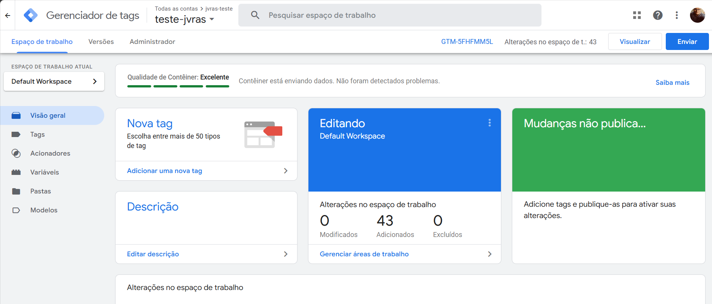
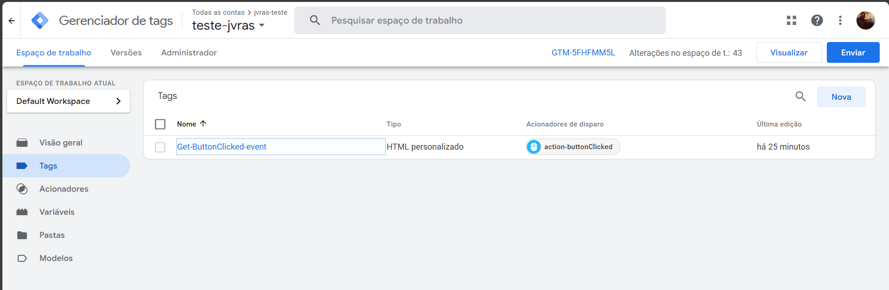
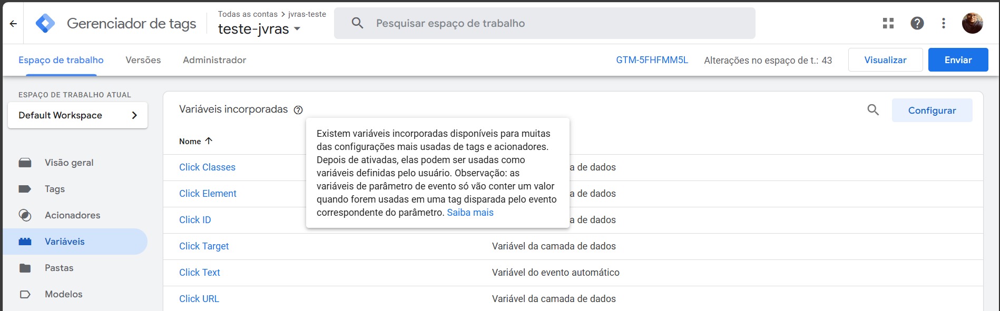
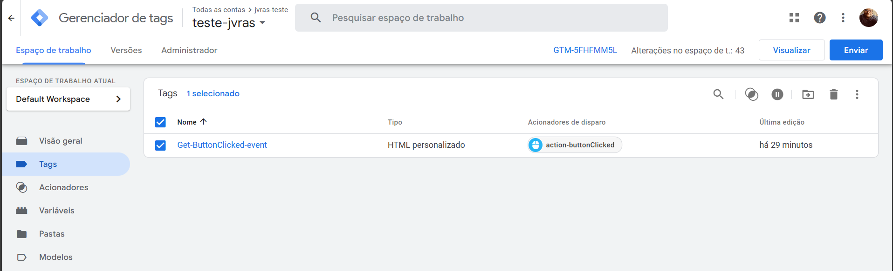
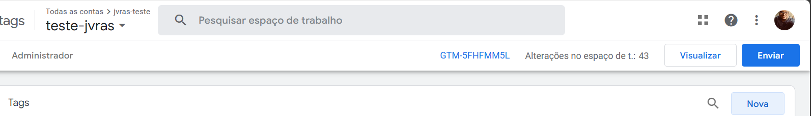

### Projeto de Telemetria e Usabilidade com Google Tag Manager (GTM)

Este projeto visa implementar telemetria e usabilidade utilizando o Google Tag Manager (GTM) em um projeto real.

#### Configuração Inicial

1. **Documentação do Next.js**:
   - O Next.js facilita a integração com bibliotecas de terceiros. Consulte a documentação oficial: [Next.js - Third Party Libraries](https://nextjs.org/docs/app/building-your-application/optimizing/third-party-libraries).

2. **Configuração do GTM**:
   - Para configurar o GTM no projeto, siga este tutorial em vídeo: [Configuração do GTM](https://www.youtube.com/watch?v=R5P0hWixp-8).
   - Alternativamente, consulte a documentação oficial: [Documentação GTM](https://developers.google.com/tag-platform/gtagjs?hl=pt-br).

#### Implementação

O projeto utiliza o Next.js Router para simular uma API dentro do próprio Next.js, facilitando o estudo de caso. Configuramos uma tag específica para capturar eventos de clique.

#### Tela Inicial do Google Tag Manager

#### Configuração de Eventos

Podemos configurar diversos eventos e checagens para buscar e capturar dados, injetando scripts nas tags. Inicialmente, criamos uma tag chamada `Get-ButtonClicked-event`, onde inserimos um script JavaScript para garantir compatibilidade com versões mais recentes do JavaScript.

Se alguns tipos de eventos de tags não aparecerem, é necessário ir em variáveis para configurar. Por padrão, ele não habilita novos tipos de tag, e a recomendação é ativar todas.

#### Monitoramento de Cliques

Com essa configuração, conseguimos utilizar o GTM para monitorar cliques:

#### Playground do GTM

O GTM também oferece um playground onde, a partir da tag criada, é possível testar a integração por meio do site embutido, clicando em "Visualizar":

### Conclusão

Este guia fornece uma visão geral de como configurar e utilizar o Google Tag Manager em um projeto Next.js para telemetria e usabilidade. Siga os links fornecidos para obter mais detalhes e tutoriais.

### Links Úteis

- [Documentação do Next.js](https://nextjs.org/docs/app/building-your-application/optimizing/third-party-libraries)
- [Configuração do GTM (Vídeo)](https://www.youtube.com/watch?v=R5P0hWixp-8)
- [Documentação GTM](https://developers.google.com/tag-platform/gtagjs?hl=pt-br)