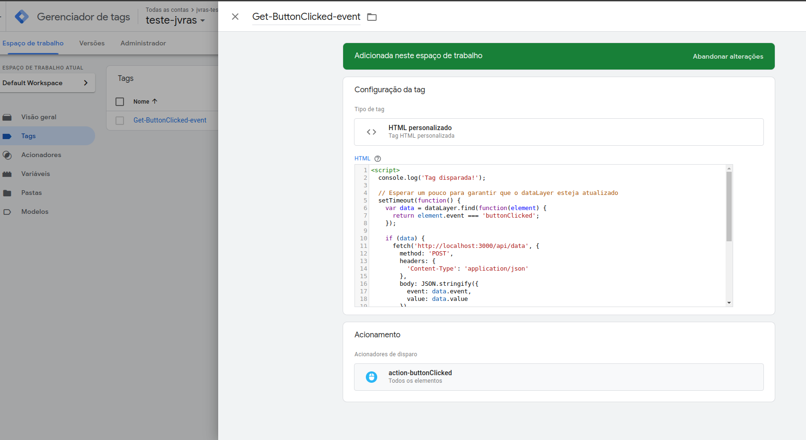
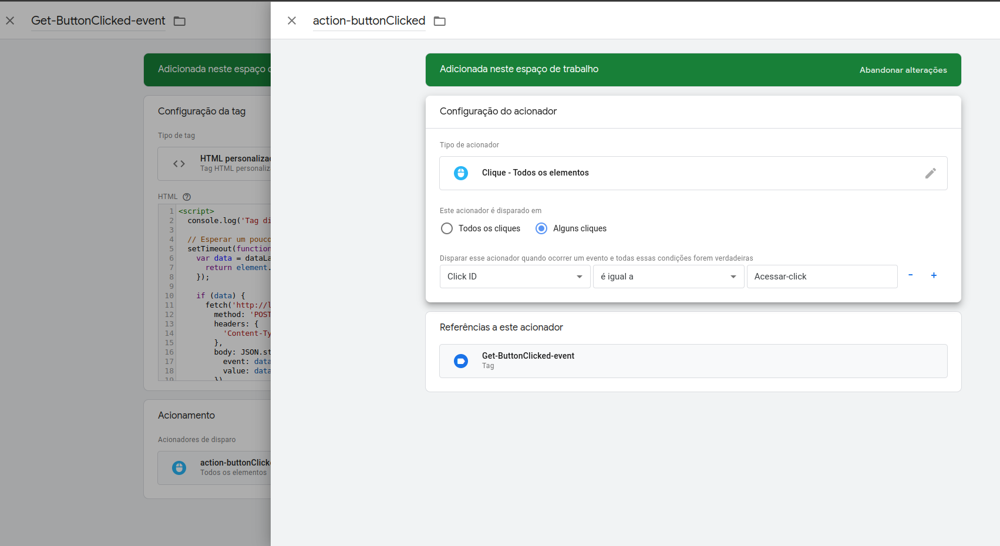

### Projeto de Telemetria e Usabilidade com Google Tag Manager (GTM)

Este projeto visa estudar a implementação de uma telemetria utilizando o Google Tag Manager (GTM) em um projeto real.

#### Configuração Inicial

1. **Documentação do Next.js**:
   - O Next.js facilita a integração com bibliotecas do GOOGLE GTM. Consulte a documentação oficial: [Next.js - Third Party Libraries](https://nextjs.org/docs/app/building-your-application/optimizing/third-party-libraries).

2. **Configuração do GTM**:
   - Para configurar o GTM no projeto, siga este tutorial em vídeo: [Configuração do GTM](https://www.youtube.com/watch?v=R5P0hWixp-8).
   - Alternativamente, consulte a documentação oficial: [Documentação GTM](https://developers.google.com/tag-platform/gtagjs?hl=pt-br).

#### Implementação

O projeto utiliza o Next.js API Routes para simular uma API dentro do próprio Next.js, facilitando o estudo de casos. Configuramos uma tag específica para capturar eventos de clique.

#### Tela Inicial do Google Tag Manager


### Configuração de Eventos

Podemos configurar diversos eventos e checagens para buscar e capturar dados, injetando scripts nas tags.

Essas checagens podem ser realizadas em páginas, formulários, elementos, entre outros. Elas vão além de cliques ou textos inseridos.

**Atenção: o GTM possui limitações quanto ao JavaScript que consegue interpretar. Considere que ele só executa JavaScript mais antigo, sem muitas funcionalidades modernas como funções de array e outras inovações.**


Se alguns tipos de eventos nos acionadores das tags não aparecerem, é necessário ir em variáveis para configurar. Por padrão, ele não habilita novos tipos de tag, e a recomendação é ativar todas.


### Monitoramento de Cliques

Inicialmente, é importante destacar que estamos usando o [`dataLayer`] para capturar e transportar esses dados para nossa API. Criamos uma tag chamada `Get-ButtonClicked-event`, onde inserimos um script JavaScript que envia os dados capturados pelo evento criado pelo [`sendGTMEvent`] (uma funcionalidade fornecida pelo Next.js e sua integração com o GTM). Normalmente, teríamos que fazer algo como:

```js
window.dataLayer.push({
    'event': 'cardClicked',
    'cardName': name
});
```

Esse código seria executado no clique do card (colocamos no [`handleRedirect`])

Com essa configuração, conseguimos utilizar o GTM para monitorar cliques usando o [`dataLayer`]:







#### Playground do GTM

O GTM também oferece um playground onde, a partir da tag criada, é possível testar a integração por meio do site embutido, clicando em "Visualizar":


### Conclusão

Este guia fornece uma visão geral de como configurar e utilizar o Google Tag Manager em um projeto Next.js para telemetria e usabilidade. Siga os links fornecidos para obter mais detalhes e tutoriais.

### Links Úteis

- [Documentação do Next.js](https://nextjs.org/docs/app/building-your-application/optimizing/third-party-libraries)
- [Configuração do GTM (Vídeo)](https://www.youtube.com/watch?v=R5P0hWixp-8)
- [Documentação GTM](https://developers.google.com/tag-platform/gtagjs?hl=pt-br)
- [Captura de dados com DataLayer](https://www.mkt4edu.com/blog/o-que-e-data-layer-e-como-usa-lo-no-google-tag-manager)
- [Documentação criar eventos GTM](https://www.cayman.com.br/postagem/59/como-criar-eventos-personalizados-no-google-tag-manager)